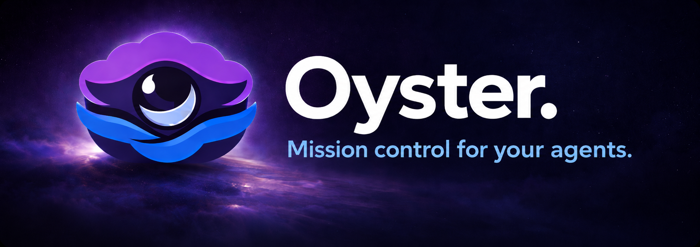

<p align="center"></p>

[](https://github.com/oyster-to/oyster/releases)
[](https://www.npmjs.com/package/oyster-os)
[](https://www.npmjs.com/package/oyster-os)
[]()
[](LICENSE)

---

# 🦪 Mission control for your agents.

Oyster keeps your AI work organised, synced and ready to share across devices, with memory and publishing built in. Use whichever agents you prefer and switch anytime.

```bash
# 1. Install
npm install -g oyster-os

# 2. Start
oyster

# 3. Open your browser to http://localhost:4444
```

## Why Oyster

Your AI sessions, files, and memories live in tool-shaped silos. Oyster puts every agent's work on one shared surface, organised by space.

- **See every agent at work** — Oyster watches Claude Code automatically. Live transcripts, status (active / awaiting / disconnected / done), and the files each session touched, all on Home.
- **Memory that survives sessions** — `remember` notes are first-class. Every agent's `recall` reads from the same store, so context follows you across tools and machines.
- **Drop in any project** — point Oyster at a folder and it scans for documents, apps, and diagrams, then attributes future sessions back to the right project.
- **Bring any agent** — Oyster is an MCP server. Claude Code, Cursor, VS Code, Windsurf, or your own — one standard, every agent.

## Quick Start

```bash
npm install -g oyster-os
oyster
```

That's it. On first run, Oyster connects you to an AI provider (opens your browser to sign in). Then your workspace opens at **http://localhost:4444**.

Or try without installing:

```bash
npx oyster-os
```

## Connect Your AI

Oyster is an MCP server. Any MCP-compatible tool can connect and control your workspace.

**Claude Code:**

```bash
claude mcp add --scope user --transport http oyster http://localhost:4444/mcp/
```

**Cursor / VS Code / other MCP clients** — add to your MCP config:

```json
{
  "oyster": {
    "type": "http",
    "url": "http://localhost:4444/mcp/"
  }
}
```

Once connected, your AI can list spaces, open artefacts, create documents, onboard projects, and manage the surface directly.

## Onboard a Project

From the Oyster chat bar:

```
onboard my project at ~/Dev/my-project
```

Oyster scans the folder for documents, apps, and diagrams and adds them to the surface automatically.

## Commands

| Command | What it does |
|---|---|
| `/s <space>` | Switch to a space — `/s blunderfixer` opens that space |
| `/o <query>` | Open an artefact by name — `/o pricing deck` finds and opens it |
| `#<space>` | Quick space switch — `#home` goes home, `#bf` matches blunderfixer |
| `#<number>` | Jump to a numbered space — `#1` switches to first space |
| `#.` | Go to the home screen |
| normal chat | Ask Oyster anything — navigate, organise, or create work |

## Architecture

```
Browser → http://localhost:4444
              |
        Oyster Server
         - SQLite (artefacts, spaces)
         - MCP server (/mcp/)
         - SSE push (instant UI updates)
         - Static web UI
         - Chat proxy → OpenCode → LLM
```

## Status

Early v1. Local-first. Cross-device for Pro. Built for fast iteration.

- **Now (`0.8.x`)** — Cross-device memory sync (Pro). Anything you remember on one signed-in device shows up on every other.
- **Recently shipped** — Sign in with GitHub or magic-link (0.7.0), Publish & share artefacts (0.7.0), Spaces sync across devices (0.7.1), Cloud memory store (0.8.0).
- **Next (`0.9.x`)** — Fresh-machine restore from cloud, semantic recall, *Pick up here* cross-device session priming, cold-storage transcript backup, multi-agent ingestion (Cursor, Codex, OpenCode).
- **Later** — Artefact version history, cross-device artefact-byte sync.

See every shipped change in the [changelog](https://oyster.to/changelog). Pro details on the [pricing page](https://oyster.to/pricing).

## Contributing

Oyster is early, but focused contributions are welcome.

1. Open an issue first
2. Keep the scope tight
3. Send a focused PR with a clear before and after

### Development

```bash
git clone https://github.com/oyster-to/oyster.git
cd oyster
cd web && npm install && cd ../server && npm install && cd ..
npm run dev
# → dev server at http://localhost:7337 (proxies to server at 3333)
```

## Licence

[AGPL-3.0](LICENSE)

Copyright (c) 2026 Matthew Slight

You can use, modify, and distribute this software freely. If you run a modified version as a network service, you must make your source code available under the same licence.
